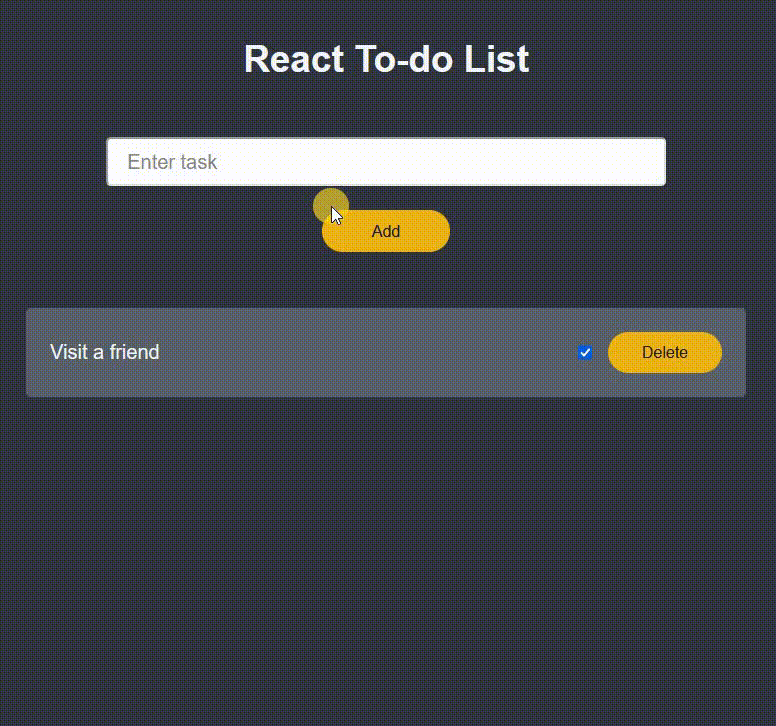

# React - To Do list

# 🔗 [Live Preview](https://main--willowy-begonia-93f456.netlify.app/)

## About this project: 

The goal of this project was to practice understanding of some important React concepts such as manipulating state, using props and maps to make a functional To-Do list

---

## Features 📙

* Adding Tasks: Enter a task in the input field and click "Add" to add them to the to-do list.

* Task Delete: Each task comes with a "Delete" button to remove it from the list.

* Task Status: Each task also comes with a check box button to mark whether it is completed or not.

---

## Languages and features 👨‍💻 

- React: useState hook, functions, maps, components, if statements, sending states and functions as props to components
- Sass: nesting, mixins, variables

Thanks for checking out my projects.
